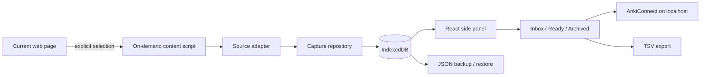

# Anki Cards Collector

I built this because I kept running into the same small annoyance while studying languages: the useful phrase is usually on a web page, while Anki is somewhere else.

Anki Cards Collector keeps that gap small. Select a word, phrase, or sentence, collect it into a local inbox, keep the context, and decide later whether it deserves a card.

This repository contains the public implementation: deliberately small, local-first, and usable without an account or application server.

## What it does

- captures an explicit text selection from the current page;
- keeps the surrounding visible context and a privacy-filtered source URL;
- works on arbitrary web pages, not only one learning platform;
- has a small Duolingo adapter for visible DOM context, without private APIs or network interception;
- deduplicates lexical units while preserving repeated occurrences;
- gives every item an inbox / ready / archived review state;
- supports keyboard-first review with J/K or arrow navigation and E/R/I/A actions;
- lets you correct the expression, language, context, and learner note before export;
- exports ready items through AnkiConnect;
- updates previously exported notes instead of blindly creating duplicates;
- provides TSV fallback plus versioned JSON backup and restore;
- validates and previews a JSON restore before writing anything;
- lets source URL retention be set to origin+path, non-tracking query parameters, or no URL;
- stores the collection locally in IndexedDB.

The extension does **not** continuously watch browsing, scrape credentials, read cookies, call Duolingo private APIs, or send study data to a server.

## A 60-second walkthrough

1. Open a page containing language you want to keep.
2. Select a useful expression.
3. Open the extension side panel and click **Collect selection** (or use **Collect for Anki** from the selection context menu).
4. Review the captured expression and context. Correct them or add a learner note if needed.
5. Mark it **Ready**.
6. With Anki + AnkiConnect running, click **Send ready to Anki**.

If Anki is not available, download the ready items as TSV. JSON backup preserves the local corpus and can be restored through a validated dry run.

## Why the data model has two objects

A phrase and an encounter with that phrase are not the same thing.

If I collect `tener ganas de` today and meet it again next week in a different sentence, I want one lexical item and two pieces of evidence. The model therefore separates:

- **LexicalUnit** — the thing I may want to learn;
- **Occurrence** — where and how I met it.

That distinction makes deduplication useful without throwing away the context in which an expression appeared.

## Architecture



There is no application backend. The background service worker coordinates user-triggered capture; the side panel owns review and export; Dexie keeps persistence behind a repository boundary.

More detail: [architecture](docs/architecture.md) · [privacy](docs/privacy.md) · [ADRs](docs/decisions/)

## Design choices worth discussing

This project is intentionally not a feature catalogue.

- **Local-first over a backend.** The current workflow does not need accounts, deployment, or remote data retention.
- **Manual capture over ambient scraping.** The extension wakes up because the user selected something.
- **Generic web first.** A source-specific integration is an adapter, not the product boundary.
- **Stable Collector IDs.** Export is an upsert workflow, not a repeated “add note” button.
- **Context survives deduplication.** Repeated encounters become occurrences rather than duplicate cards.
- **Explicit edit collisions.** Changing expression/language never silently merges two collected items.
- **Dry-run restore.** Backup parsing, merge planning, and transactional restore share the same invariants.
- **Privacy-filtered sources.** Raw page URLs are reduced before persistence; credentials/fragments never reach the local corpus.
- **Plain fallbacks.** TSV and JSON keep the user's data useful even if AnkiConnect is unavailable.

The decisions and their consequences are recorded in the ADRs instead of being hidden in code comments.

## Run it locally

Requirements:

- Node.js 22+
- a recent Chromium-based browser with Side Panel support
- Anki + [AnkiConnect](https://ankiweb.net/shared/info/2055492159) for direct export (optional)

```bash
npm install
npm run check
```

Then:

1. open `chrome://extensions`;
2. enable **Developer mode**;
3. choose **Load unpacked**;
4. select the generated `dist/` directory.

The extension only requests localhost host access for AnkiConnect. Page access is provided at the moment of an explicit user action through `activeTab` + `scripting`.

## Development

```bash
npm run typecheck
npm test
npm run build
```

`npm run check` runs all three and also asserts that the production manifest has no persistent all-sites content script or broad host permission.

A small Playwright suite loads the real unpacked Chromium extension and exercises selection capture, empty-selection failure, the shared context-menu handler, side-panel refresh, keyboard review, and restricted-page failure. The same browser job runs axe against the rendered side panel to catch WCAG A/AA regressions. CI builds a test-only extension variant for that suite; its E2E hook and localhost fixture permission are not present in the production bundle.

Tests currently focus on the parts where accidental regressions are expensive: text normalisation, source URL sanitisation, deduplication with occurrence preservation, edit collisions and identity, backup validation/merge behaviour, review state, Anki upserts, portable export formatting, and browser permission/capture boundaries.

## Scope

The public repository is intentionally focused on the local capture → review → Anki workflow. Its roadmap covers maintenance and hardening of that implementation only.

See the [maintenance roadmap](docs/roadmap.md).

## Project status

**Working public release.**

The current hardening backlog includes export diagnostics, release packaging, and IndexedDB migration tests.

## Disclaimer

Anki is a trademark of Ankitects Pty Ltd. Duolingo is a trademark of Duolingo, Inc. This project is independent and is not affiliated with or endorsed by either company.
