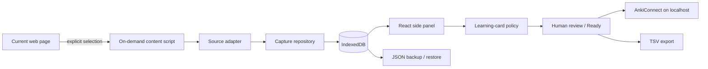

# Anki Cards Collector

I built this because I kept running into the same small annoyance while studying languages: the useful phrase is usually on a web page, while Anki is somewhere else.

Anki Cards Collector keeps that gap small. Select a word, phrase, or sentence, collect it into a local inbox, keep the context, and decide later whether it deserves a card.

This repository contains the public implementation: deliberately small, local-first, and usable without an account or application server.

## What it does

- captures an explicit text selection from the current page;
- keeps the surrounding visible context and a privacy-filtered source URL;
- works on arbitrary web pages, not only one learning platform;
- has a small Duolingo adapter for visible DOM context, without private APIs or network interception;
- separates a canonical lexical unit from the surface forms actually observed on pages;
- deduplicates lexical units while preserving repeated occurrences and their observed forms;
- gives every item an inbox / ready / archived review state;
- supports keyboard-first review with J/K or arrow navigation and E/R/I/A actions;
- lets you correct the expression, language, context, and learner note before export;
- derives one reviewable learning-card proposal from each captured lexical unit instead of treating raw text as a finished card;
- explains why a proposal was chosen and blocks overly broad or underspecified captures from becoming ready;
- exports ready items through AnkiConnect with live batch progress and per-item failure reporting;
- updates previously exported notes instead of blindly creating duplicates;
- provides TSV fallback plus versioned JSON backup and restore;
- validates and previews a JSON restore before writing anything;
- lets source URL retention be set to origin+path, non-tracking query parameters, or no URL;
- stores the collection locally in IndexedDB.

The extension does **not** continuously watch browsing, scrape credentials, read cookies, call Duolingo private APIs, or send study data to a server.

## A 60-second walkthrough

1. Open a page containing language you want to keep.
2. Select a useful expression.
3. Open the extension side panel and click **Collect selection** (or use **Collect for Anki** from the selection context menu).
4. Review the captured expression and context. Correct them or add a learner note if needed.
5. Mark it **Ready**.
6. With Anki + AnkiConnect running, click **Send ready to Anki**.

If Anki is not available, download the ready items as TSV. JSON backup preserves the local corpus and can be restored through a validated dry run.

## Why the data model has two objects

A phrase and an encounter with that phrase are not the same thing.

The learning target and the text that appeared on a page are not always identical. I may observe `tengo ganas de`, but decide that the canonical unit I want to keep is `tener ganas de`.

The model therefore separates:

- **LexicalUnit** — the canonical thing I may want to learn;
- **Occurrence** — one observed surface form, its context, and its source.

If `tengo ganas de`, `tenía ganas de`, and `tener ganas de` are consolidated under the same canonical unit, those forms remain separate occurrences rather than being flattened away. A later capture of an already-observed surface form routes back to that canonical unit.

## Architecture



There is no application backend. The background service worker coordinates user-triggered capture; the side panel owns review and export; Dexie keeps persistence behind a repository boundary.

More detail: [architecture](docs/architecture.md) · [learning-card policy](docs/learning-card-policy.md) · [privacy](docs/privacy.md) · [ADRs](docs/decisions/)

## Design choices worth discussing

This project is intentionally not a feature catalogue.

- **Local-first over a backend.** The current workflow does not need accounts, deployment, or remote data retention.
- **Manual capture over ambient scraping.** The extension wakes up because the user selected something.
- **Generic web first.** A source-specific integration is an adapter, not the product boundary.
- **Stable Collector IDs.** Export is an upsert workflow, not a repeated “add note” button.
- **Captured evidence is not automatically a card.** Review derives one bounded proposal and requires explicit approval.
- **No invented semantics.** If the corpus does not contain a meaning or usable retrieval cue, the policy asks for review instead of fabricating one.
- **Partial failure isolation.** One rejected Anki note does not hide or stop the rest of a ready batch.
- **Observed forms survive canonicalization.** Inflected or contextual surface forms live on occurrences instead of being overwritten by the canonical learning target.
- **Context survives deduplication.** Repeated encounters become occurrences rather than duplicate cards.
- **Explicit edit collisions.** Changing expression/language never silently merges two collected items.
- **Dry-run restore.** Backup parsing, merge planning, and transactional restore share the same invariants.
- **Privacy-filtered sources.** Raw page URLs are reduced before persistence; credentials/fragments never reach the local corpus.
- **Plain fallbacks.** TSV and JSON keep the user's data useful even if AnkiConnect is unavailable.

The decisions and their consequences are recorded in the ADRs instead of being hidden in code comments.

## Run it locally

Requirements:

- Node.js 22+
- a recent Chromium-based browser with Side Panel support
- Anki + [AnkiConnect](https://ankiweb.net/shared/info/2055492159) for direct export (optional)

```bash
npm install
npm run check
```

Then:

1. open `chrome://extensions`;
2. enable **Developer mode**;
3. choose **Load unpacked**;
4. select the generated `dist/` directory.

The extension only requests localhost host access for AnkiConnect. Page access is provided at the moment of an explicit user action through `activeTab` + `scripting`.

## Development

```bash
npm run typecheck
npm test
npm run build
```

`npm run check` runs all three and also asserts that the production manifest has no persistent all-sites content script or broad host permission.

A small Playwright suite loads the real unpacked Chromium extension and exercises selection capture, empty-selection failure, the shared context-menu handler, side-panel refresh, keyboard review, and restricted-page failure. The same browser job runs axe against the rendered side panel to catch WCAG A/AA regressions. CI builds a test-only extension variant for that suite; its E2E hook and localhost fixture permission are not present in the production bundle.

Tests currently focus on the parts where accidental regressions are expensive: text normalisation, source URL sanitisation, deterministic learning-card proposals, deduplication with occurrence preservation, edit collisions and identity, backup validation/merge behaviour, review state, Anki upserts and partial failures, portable export formatting, a frozen IndexedDB v1 migration fixture, and browser permission/capture boundaries.

## Release package

```bash
npm run package:store
```

This creates a validated Chrome Web Store ZIP plus SHA-256 checksum in `release/`. CI also produces a synthetic 640x400 store screenshot from the real Chromium extension flow.

The repository does not contain Chrome Web Store credentials. See [release checklist](docs/release.md) and [store listing copy](docs/store-listing.md).

## Scope

The public repository is intentionally focused on the local capture → review → Anki workflow. Its roadmap covers maintenance and hardening of that implementation only.

See the [maintenance roadmap](docs/roadmap.md).

## Project status

**Working public release.**

Repository-side release packaging and store validation are implemented. First publication still requires the Chrome Web Store dashboard/account steps described in the release checklist.

## Disclaimer

Anki is a trademark of Ankitects Pty Ltd. Duolingo is a trademark of Duolingo, Inc. This project is independent and is not affiliated with or endorsed by either company.
