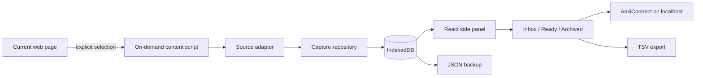

# Anki Cards Collector

I built this because I kept running into the same small annoyance while studying languages: the useful phrase is usually on a web page, while Anki is somewhere else.

Anki Cards Collector keeps that gap small. Select a word, phrase, or sentence, collect it into a local inbox, keep the context, and decide later whether it deserves a card.

This repository is the public Phase 1 of the project: deliberately small, local-first, and usable without an account or backend.

## What it does

- captures an explicit text selection from the current page;
- keeps the surrounding visible context and source URL;
- works on arbitrary web pages, not only one learning platform;
- has a small Duolingo adapter for visible DOM context, without private APIs or network interception;
- deduplicates lexical units while preserving repeated occurrences;
- gives every item an inbox / ready / archived review state;
- exports ready items through AnkiConnect;
- updates previously exported notes instead of blindly creating duplicates;
- provides TSV and JSON fallbacks;
- stores the collection locally in IndexedDB.

The extension does **not** continuously watch browsing, scrape credentials, read cookies, call Duolingo private APIs, or send study data to a server.

## A 60-second walkthrough

1. Open a page containing language you want to keep.
2. Select a useful expression.
3. Open the extension side panel and click **Collect selection** (or use **Collect for Anki** from the selection context menu).
4. Review the captured expression and context.
5. Mark it **Ready**.
6. With Anki + AnkiConnect running, click **Send ready to Anki**.

If Anki is not available, download the ready items as TSV. JSON backup is there for the local corpus itself.

## Why the data model has two objects

A phrase and an encounter with that phrase are not the same thing.

If I collect `tener ganas de` today and meet it again next week in a different sentence, I want one lexical item and two pieces of evidence. The model therefore separates:

- **LexicalUnit** — the thing I may want to learn;
- **Occurrence** — where and how I met it.

That small distinction makes deduplication useful instead of destructive, and leaves room for better prioritisation later.

## Architecture



There is no application backend in Phase 1. The background service worker coordinates user-triggered capture; the side panel owns review and export; Dexie keeps persistence behind a repository boundary.

More detail: [architecture](docs/architecture.md) · [privacy](docs/privacy.md) · [ADRs](docs/decisions/)

## Design choices worth discussing

This project is intentionally not a feature catalogue.

- **Local-first over a backend.** Phase 1 does not need accounts, sync, deployment, or a privacy policy for a server that adds no value yet.
- **Manual capture over ambient scraping.** The extension wakes up because the user selected something.
- **Generic web first.** A source-specific integration is an adapter, not the product boundary.
- **Stable Collector IDs.** Export is an upsert workflow, not a repeated “add note” button.
- **Context survives deduplication.** Repeated encounters become occurrences rather than duplicate cards.
- **Plain fallbacks.** TSV and JSON keep the user's data useful even if AnkiConnect is unavailable.

The decisions and their consequences are recorded in the ADRs instead of being hidden in code comments.

## Run it locally

Requirements:

- Node.js 22+
- a recent Chromium-based browser with Side Panel support
- Anki + [AnkiConnect](https://ankiweb.net/shared/info/2055492159) for direct export (optional)

```bash
npm install
npm run check
```

Then:

1. open `chrome://extensions`;
2. enable **Developer mode**;
3. choose **Load unpacked**;
4. select the generated `dist/` directory.

The extension only requests localhost host access for AnkiConnect. Page access is provided at the moment of an explicit user action through `activeTab` + `scripting`.

## Development

```bash
npm run typecheck
npm test
npm run build
```

`npm run check` runs all three. GitHub Actions runs the same check for pull requests.

Tests currently focus on the parts where accidental regressions are expensive: text normalisation, deduplication with occurrence preservation, review state, and portable export formatting.

## Scope

Phase 1 is meant to be a finished portfolio project and a tool I can actually use.

It deliberately leaves out cloud sync, accounts, AI-generated cards, automatic translation, browser history mining, mobile capture, and a SaaS backend. Those may be useful later, but adding them here would make the privacy story worse and the architecture harder to judge.

See the [roadmap](docs/roadmap.md) for the boundary between “polish Phase 1” and “build a different product”.

## Project status

**Public Phase 1: working vertical slice.**

The next useful work is mostly product hardening: richer editing before export, import/restore for JSON backups, browser-level integration tests, accessibility passes, and packaging/release automation.

## Disclaimer

Anki is a trademark of Ankitects Pty Ltd. Duolingo is a trademark of Duolingo, Inc. This project is independent and is not affiliated with or endorsed by either company.
