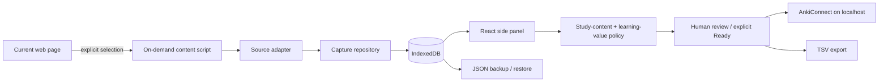

# Anki Cards Collector

Anki Cards Collector is a local-first Chromium extension for collecting useful language from the web, reviewing it as study material, and explicitly sending approved cards to Anki.

It exists to keep the gap between “I want to remember this” and a durable Anki card small without turning browsing into background scraping. The extension has no application server, no account system, and no telemetry.

## Install

**Phase 1 release candidate. Chrome Web Store publication is pending final acceptance of the exact release candidate.**

There is no public Chrome Web Store install URL yet. The normal-user installation path will be the published Chrome Web Store listing once the accepted `v0.1.0` release is live. Until then, Developer Mode is an evaluator/developer path, not the public installation route.

See the [release checklist](docs/release.md) for the exact release/distribution gate.

## Daily workflow

1. Select a useful word, phrase, or sentence on a web page.
2. Choose **Collect** in the side panel or **Collect for Anki** from the selection context menu.
3. The capture enters **Inbox** with visible context and privacy-filtered source metadata.
4. Review the lexical unit, observed evidence, learner note, deterministic study-content proposal, and learning-value recommendation.
5. Edit when needed and explicitly mark the item **Ready**.
6. Open **Export Ready** to preview the actual resolved Anki destinations.
7. With Anki Desktop + AnkiConnect running, export to the configured deck/note type.

Ready is the export authorization boundary. A recommendation is guidance only: it is not Ready, and an Archive-for-now recommendation does not automatically archive anything.

Visible Duolingo backfill is a separate explicit flow:

```text
visible Duolingo material
  -> Staged
  -> select/import evidence
  -> Inbox
  -> review
  -> explicit Ready
  -> Anki
```

Staged material never writes directly to Anki.

## What Collector does

- captures an explicit text selection from the current page;
- keeps surrounding visible context and a privacy-filtered source URL;
- works on ordinary web pages through on-demand `activeTab` + `scripting`;
- provides an optional visible-DOM Duolingo adapter without private APIs or network interception;
- separates canonical lexical units from their observed surface-form occurrences;
- deduplicates evidence without collapsing intentionally separate lexical identities;
- supports Inbox / Ready / Archived workflow states;
- derives deterministic reviewable study content from accepted local evidence;
- provides optional advisory canonical-form assistance that changes nothing until explicitly accepted;
- provides deterministic **Study / Improve / Evidence only / Archive for now** guidance without changing workflow state automatically;
- supports multiple language routes, decks, export profiles, and explicit mapped existing Anki note types;
- preserves user-owned note-type fields/templates/CSS and writes only configured mapped fields;
- exports idempotently through AnkiConnect and recovers from deleted/stale note identities;
- provides TSV fallback plus validated JSON backup/restore;
- stores the corpus locally in IndexedDB.

## Anki integration

AnkiConnect is a localhost-only integration. Collector uses it only after an explicit user action for operations such as:

- connection/catalog refresh;
- deck/model/note-type inspection;
- guided export-profile setup and profile revalidation;
- bounded representative existing-card inspection where applicable;
- export, update, move, and stale/deleted-note recovery.

Collector does not continuously poll Anki.

Language routes resolve to configured export profiles. Per-item bindings pin exported identity so changing a later default route cannot silently move an existing Anki note. Mapped user-owned note types remain user-owned: Collector does not add fields or rewrite templates/CSS.

## What is stored

Persistent corpus state lives locally and includes lexical units, occurrences, review states, notes, stable Collector IDs, and export bindings. Collector settings include source-retention policy plus Anki export profiles and language routes.

Backup format v4 preserves the durable corpus, export bindings, and Collector settings. It is **not** a full browser-session snapshot: transient Staged/session state, onboarding presentation state, and in-memory UI/review-session state are outside the backup guarantee.

If a restore has already committed the corpus/settings and a later UI refresh fails, the restored data remains durable. Reload the extension UI; the restore is not rolled back.

See [backup and restore](docs/backup-and-restore.md) and [privacy boundary](docs/privacy.md).

## Privacy boundary

Collector does **not**:

- continuously watch browsing;
- scrape cookies, credentials, authentication tokens, browser history, or page network traffic;
- use a private Duolingo API;
- send study material to an application server;
- include telemetry or analytics;
- depend on a remote morphology/canonical-form provider.

Source URLs are reduced according to the configured retention policy before they enter the corpus.

## Architecture


```mermaid
flowchart LR
    Page[Current web page] -->|explicit selection| Injected[On-demand content script]
    Injected --> Adapter[Source adapter]
    Adapter --> Repo[Capture repository]
    Repo --> DB[(IndexedDB)]
    DB --> Panel[React side panel]
    Panel --> Policy[Study-content + learning-value policy]
    Policy --> Review[Human review / explicit Ready]
    Review --> Anki[AnkiConnect on localhost]
    Review --> TSV[TSV export]
    DB --> Backup[JSON backup / restore]
```

There is no application backend. The background service worker coordinates explicit capture/backfill operations; the side panel owns review, setup, backup/restore, and export; Dexie keeps durable corpus persistence behind repository boundaries.

More detail: [architecture](docs/architecture.md) · [user journey](docs/product/user-journey.md) · [learning-card policy](docs/learning-card-policy.md) · [privacy](docs/privacy.md) · [ADRs](docs/decisions/)

## Build from source / contribute

This is separate from the future normal-user Chrome Web Store install path.

Requirements:

- Node.js 22.23.3
- npm 11.6.0
- a recent Chromium-based browser with Side Panel support
- Anki + [AnkiConnect](https://ankiweb.net/shared/info/2055492159) for direct Anki operations

Canonical verification uses the committed dependency graph:

```bash
npm ci
npm run check
```

To evaluate the unpacked extension:

1. run the production build;
2. open `chrome://extensions`;
3. enable **Developer mode**;
4. choose **Load unpacked**;
5. select `dist/`.

Use `npm install` only when deliberately changing dependencies and commit the resulting lockfile update.

## Release package

```bash
npm ci
npm run package:store
```

This produces a deterministic validated Chrome Web Store ZIP plus SHA-256 checksum in `release/`. Release builds use production React semantics, contain no source maps or TypeScript sources, and are built with the pinned Node/npm toolchain.

Build-time extension icons are generated into `dist/icons/` from the committed brand source asset. CI also generates a synthetic 640x400 screenshot from the real extension UI for Chrome Web Store use.

The repository contains no Chrome Web Store publisher credentials. See [release checklist](docs/release.md) and [store listing copy](docs/store-listing.md).

## Project status

**Phase 1 feature work is complete. ACCP-025 is the final release/distribution gate.**

ACCP-023 (reproducible production build) and ACCP-024 (restore post-commit consistency) are merged. The remaining Phase 1 work is to accept one exact release candidate, merge it, create/tag the exact `v0.1.0` release artifact, publish that exact artifact to the Chrome Web Store, expose the durable public install URL here, and close the superseded public-roadmap PR.

Further product work requires a new explicit roadmap / Phase 2 decision.

## Disclaimer

Anki is a trademark of Ankitects Pty Ltd. Duolingo is a trademark of Duolingo, Inc. This project is independent and is not affiliated with or endorsed by either company.
